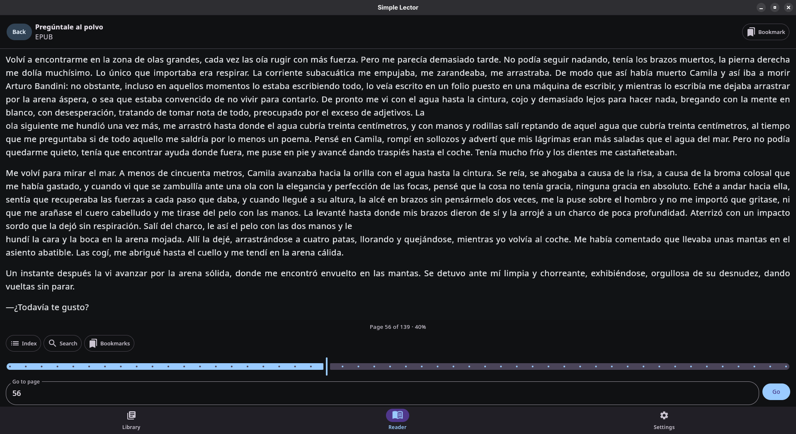
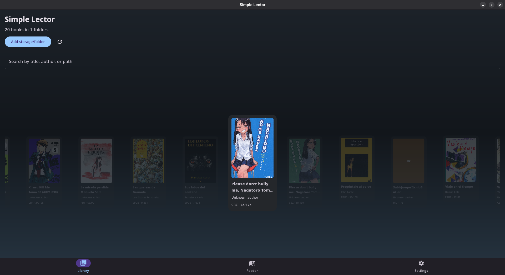
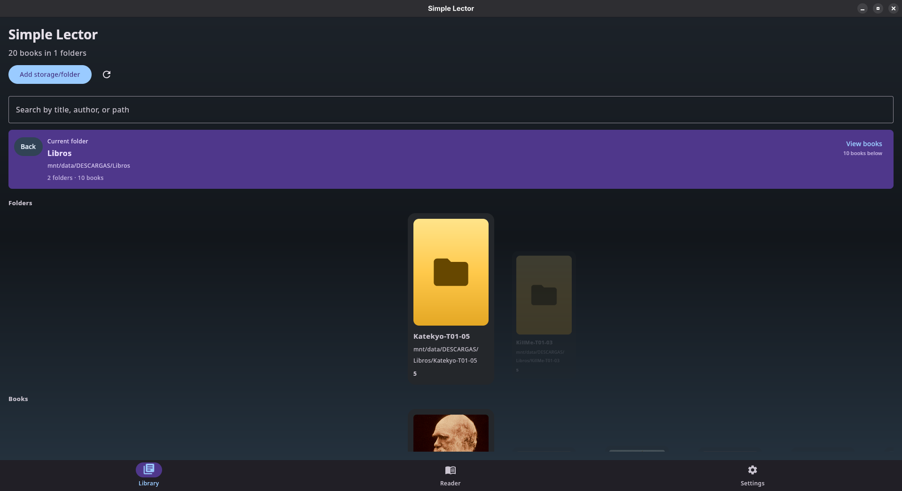
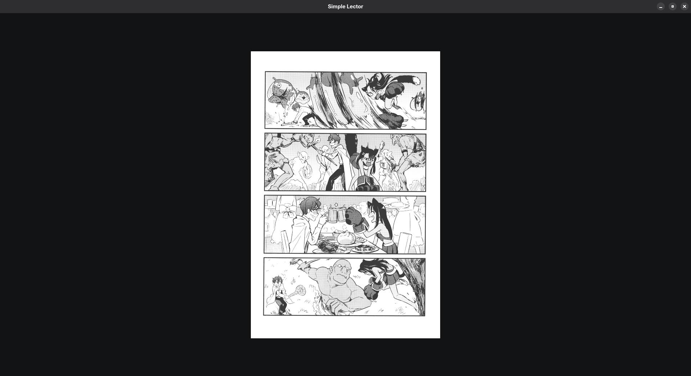

# Simple Lector

Simple Lector is a Kotlin Multiplatform reading app built with Compose Multiplatform for Android and Desktop.

It is designed as a lightweight personal library and reader for common book, document, and comic formats. The app includes library browsing, folder-based organization, reading progress tracking, bookmarks and reading preferences that are shared through the app experience.

## Features

- Android and Desktop support from a shared codebase
- Folder-based library import and refresh
- Reading support for `PDF`, `EPUB`, `TXT`, `Markdown`, `CBZ`, and `CBR` (partially)
- Cover generation and caching for supported formats
- Reading progress persistence and last-opened-book restore
- Bookmarks and reader display preferences
- Library search and folder navigation

## Screenshots

<p align="center">
  
  
</p>

<p align="center">
  
  
</p>

## Debug / Development

Build the Android debug app on Linux/macOS:

```bash
./gradlew :androidApp:assembleDebug
```

Build the Android debug app on Windows:

```powershell
.\gradlew.bat :androidApp:assembleDebug
```

Run the Desktop app on Linux/macOS:

```bash
./gradlew :composeApp:run
```

Run the Desktop app on Windows:

```powershell
.\gradlew.bat :composeApp:run
```
